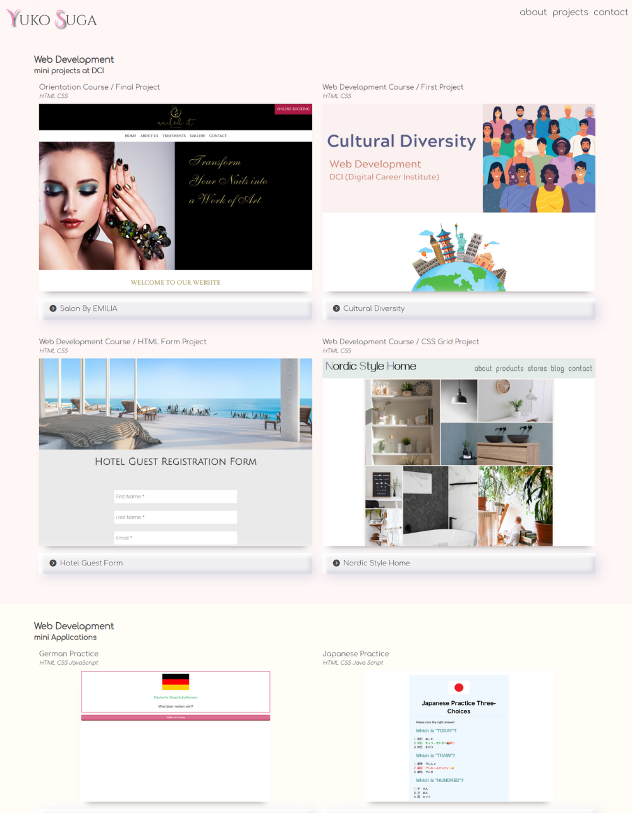

# My UI Basics Final Project 👩🏻‍💻✨
## Welcome to my portfolio repository 🚀
This repository showcases the culmination of my journey through the User Interface Basics module at DCI.  
I've dedicated my time and effort to learning and applying essential UI design principles and creating a portfolio of work that reflects my skills and creativity.

### Tools I used
-  HTML
-  CSS
-  Sass
-  Linux
-  Git
-  Bootstrap
-  Visual Studio Code
-  Canva

Click here to visit the website.  
🔗[Yuko Suga Portfolio](https://yukosuga.github.io/portfolio/) 👩🏻‍💻  
  
 
